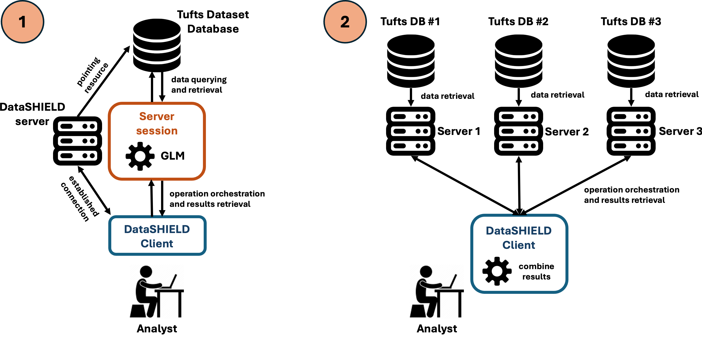

# Introduction

In this analysis, we will explore the relationship between chronic obstructive pulmonary disease (COPD) and several key predictors using a synthetic dataset. Our goal is to demonstrate how `dsOMOP` can be used to analyze clinical data while validating known clinical associations.

We utilized the **Tufts Synthetic Dataset**, which consists of fully synthetic electronic health record (EHR) data representing 567,000 synthetic patients. This dataset was generated in 2021 through a collaboration between **Syntegra, Inc.** and **Tufts Medical Center** using a deep learning transformer model. The model was trained on real-world EHR data from the **Tufts Research Data Warehouse (TRDW)**, which had already been transformed into OMOP CDM format. It includes longitudinal clinical data from patients who received care across Tufts Medicine's three hospitals, 40-practice physician network, and home health care organization.

The Tufts Synthetic Dataset contains clinical information such as patient visits, conditions, medications, laboratory measurements, procedures, observations, and device exposures, all structured according to the OMOP CDM version 5.3. The large volume of patient data, along with the realistic nature of the synthetic dataset, makes it ideal for testing the functionality of dsOMOP by exploring significant associations and patterns within the data.

Based on their relevance in the literature and their availability in our dataset, we focused on the following well-established predictors of COPD:

- Tobacco use
- Vitamin D deficiency  
- History of asthma
- History of rheumatoid arthritis

The analysis was conducted using two distinct scenarios to validate the federated approach:

1. A centralized analysis using the complete Tufts Synthetic Dataset on a single Opal server.
2. A distributed analysis where the dataset was split across three separate Opal servers, each containing a subset of patients, connected through DataSHIELD.



# Centralized analysis

## Server connection

We start by establishing a connection with ISGlobal's BRGE development Opal server. This Opal server is configured to allow access to a resource with the full version of the Tufts Synthetic Dataset:

```{r server_connection, message=FALSE, warning=FALSE}
library(DSI)
library(DSOpal)
library(dsBaseClient)
library(dsOMOPClient)
library(dsOMOPHelper)

builder <- newDSLoginBuilder()

builder$append(server="brge",
               url="https://opal.isglobal.org/brge",
               user="administrator",
               password="password",
               driver = "OpalDriver")

logindata <- builder$build()
conns <- datashield.login(logins=logindata)
```

We create an instance of `dsOMOPHelper` to interact with the database and build our desired dataset:

```{r dsOMOPHelper_instance, message=FALSE, warning=FALSE}
o <- ds.omop.helper(
    connections = conns,
    resource = "omop_demo.tufts", 
    symbol = "tufts"
)
```

## Dataset construction

### Variable definition

We define the variables that will be present in our dataset. These variables include our outcome variable and the predictor variables we will use in our generalized linear model (GLM) for COPD:

```{r define_variables, message=FALSE, warning=FALSE}
# Outcome variable
outcome_concept_id <- 255573 # Chronic Obstructive Pulmonary Disease (COPD)

# Predictor variables
observation_list <- c(
    4005823 # Tobacco use
)

condition_list <- c(
    317009, # History of asthma
    436070, # Rheumatoid arthritis
    80809   # Vitamin D deficiency
)
```

### Data retrieval

We use `dsOMOPHelper`'s `auto` function to retrieve the defined variables from the tables `condition_occurrence` and `observation`: 

```{r data_retrieval, message=FALSE, warning=FALSE}
o$auto(
    table = c("condition_occurrence", "observation"), 
    concepts = c(outcome_concept_id, condition_list, observation_list),
    columns = c("condition_occurrence_id", "observation_id") 
    # We only want the IDs to act as a boolean indicating 
    # the presence of the condition occurrence or observation
)
```

### Data type conversions

DataSHIELD will not transform an ID to a boolean if it is in a string format, so this process involves two steps:

1. Transforming the ID to numeric
2. Transforming the numeric ID to boolean

We define a function to perform these steps automatically for every variable:

```{r convert_to_numeric_and_boolean, message=FALSE, warning=FALSE}
convert_to_numeric_and_boolean <- function(variable_name, id_type, conns) {
  # Construct the full variable name in the format "tufts$variable_name.id_type"
  full_variable_name <- paste0("tufts$", variable_name, ".", id_type)

  # Create a new variable name for the numeric conversion
  new_numeric_name <- paste0(variable_name, "_numeric")
  
  # Convert the original variable to numeric
  ds.asNumeric(
    x.name = full_variable_name, 
    newobj = new_numeric_name, 
    datasources = conns
  )

  # Convert the numeric variable to boolean
  # True (1) if not equal to 0, False (0) otherwise
  # NA values are assigned 0
  ds.Boole(
    V1 = new_numeric_name, 
    V2 = 0, 
    Boolean.operator = "!=", 
    numeric.output = TRUE, 
    na.assign = 0, 
    newobj = variable_name
  )
}
```

This allows us to apply these operations to the selected variables:

```{r automatic_type_conversion, message=FALSE, warning=FALSE}
# Convert tobacco use observation to numeric and boolean
convert_to_numeric_and_boolean("tobacco_user", "observation_id", conns)

# Convert condition occurrences to numeric and boolean
convert_to_numeric_and_boolean("asthma", "condition_occurrence_id", conns)
convert_to_numeric_and_boolean("rheumatoid_arthritis", "condition_occurrence_id", conns)
convert_to_numeric_and_boolean("vitamin_d_deficiency", "condition_occurrence_id", conns)

# Convert outcome variable to numeric and boolean
convert_to_numeric_and_boolean("chronic_obstructive_pulmonary_disease", "condition_occurrence_id", conns)
```

### Create table for the GLM

We create a new table with the prepared outcome and predictors for the GLM:

```{r create_glm_table, message=FALSE, warning=FALSE}
# Get the exact name of the variables as they will be in the dataset
variable_names <- c(
  "chronic_obstructive_pulmonary_disease",
  "tobacco_user",
  "asthma",
  "rheumatoid_arthritis",
  "vitamin_d_deficiency"
)

# Create a new table with the prepared outcome and predictors
ds.cbind(
  x = variable_names,
  DataSHIELD.checks = FALSE,
  newobj = "glm_table",
  datasources = conns
)

# Check the structure of the resulting table to ensure it has been created correctly
ds.summary("glm_table")
```

## Generalized Linear Model

We can now execute the final step - running the GLM on our prepared dataset:

```{r glm, warning=FALSE, message=FALSE}
# Define the formula for the GLM
formula <- paste0(
  "chronic_obstructive_pulmonary_disease ~ ", 
  paste(
    c(
      "tobacco_user",
      "asthma",
      "rheumatoid_arthritis",
      "vitamin_d_deficiency"
    ),
    collapse = " + "
  )
)

# Fit the GLM
ds.glm(
  formula = formula, 
  data = "glm_table", 
  family = "binomial"
)
```

## Logout

After finishing the centralized analysis, we close the connection:

```{r logout}
datashield.logout(conns)
```
